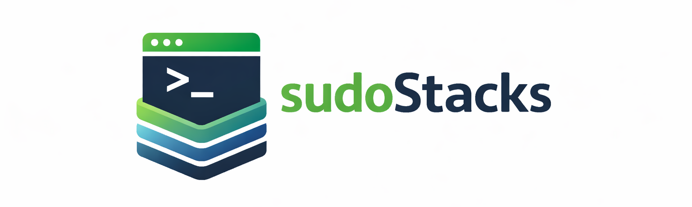

<p align="center">
  
</p>

<h1 align="center">Retreivr</h1>

<p align="center">
  Deterministic media acquisition for self‑hosted archives
</p>

<p align="center">
  
</p>

<p align="center">
  <sub>A sudoStacks project</sub>
</p>

---

## Overview

Retreivr is a self‑hosted media acquisition engine built for deterministic archival.

It takes user intent (URLs, search queries, or scheduled playlist syncs), resolves them into concrete media targets, downloads the media, applies canonical structure and metadata rules, and writes clean, reproducible files to disk.

Retreivr is not a media server and does not stream or index content. It focuses exclusively on reliable acquisition, correct metadata application, and predictable filesystem structure.

---

## v0.9.5

### Highlights
- Music Mode hardening focused on deterministic behavior and MBID-based queue contracts.
- Playlist file import pipeline added (M3U/M3U8, CSV, Apple XML, Soundiiz JSON).
- Import resolution is strict MusicBrainz-first (recording MBID required, no generic adapter search fallback).
- Import is now available via:
  - API: `POST /api/import/playlist`
  - API finalize: `POST /api/import/playlist/{batch_id}/finalize`
  - CLI: `--import-file`
  - CLI finalize (optional): `--import-finalize-m3u`
  - Web UI: Home import upload section
- Import batches return a stable `import_batch_id`, propagated to queued music jobs.
- Canonical playlist output generation uses completed history rows only:
  - `/Playlists/<import-name>.m3u`
  - Deterministic order by source index

### Notes
- Existing behavior for direct URL and scheduler flows remains unchanged.
- This release extends ingestion paths without introducing new adapters or changing metadata authority rules.

The system is designed to be:

- Deterministic (no duplicate or unstable outputs)
- Idempotent (safe to re-run)
- Canonical (consistent naming + metadata rules)
- Local-first (runs entirely under your control)

---

## Core Principles

- Deterministic execution (no duplicate downloads)
- Canonical metadata-first architecture (MusicBrainz authority)
- Clean filesystem structure (no source IDs in filenames)
- Idempotent scheduler behavior
- Single-worker design for correctness
- Local-first, Docker-first deployment

---

## What Retreivr Does

- Resolves search queries into concrete media candidates
- Downloads media using yt-dlp
- Applies canonical naming rules
- Embeds structured metadata into files
- Stores download history in SQLite
- Synchronizes playlists via deterministic snapshot + diff
- Provides a Web UI and REST API
- Sends optional Telegram run summaries

---

## What Retreivr Does NOT Do

- Stream media
- Replace Plex, Jellyfin, or music players
- Auto-delete owned files
- Circumvent DRM or protected platforms
- Run as a cloud service
- Collect telemetry

---

## Architecture Summary

### Intent Ingestion
- Direct URL (single item)
- Search queries
- Scheduled playlist sync

### Resolution
- MusicBrainz-first canonical resolution
- Spotify fallback only when OAuth + Premium validated

### Download
- Unified FIFO job queue
- yt-dlp execution
- Container finalized before metadata embedding
- Atomic move to final destination

### Metadata
- Video: title, identifiers, channel_id, canonical URL embedded
- Music: enriched via MusicBrainz (track, album, ISRC, MBIDs, artwork)
- Files are never renamed after finalization

### Scheduler
- Deterministic playlist snapshot hashing
- Reorder does not trigger re-download
- Active-job duplicate prevention
- Crash-safe idempotency
- Single structured run summary

---

## Canonical Filesystem Behavior

### Music

```
Music/
  Album Artist/
    Album (Year)/
      Disc 1/
        01 - Track Title.ext
```

Rules:
- No video IDs in filenames
- No upload dates in filenames
- Zero-padded track numbers
- Unicode-safe normalization

### Video

- Filename = sanitized title only
- Collision resolution via " (2)", " (3)"
- Source identifiers stored in metadata + SQLite only

---

## Default Container Policy

As of v0.9.3:

- Default video container: **MKV**
- No forced re-encoding
- Metadata embedded after container finalization

MKV provides strong metadata support while preserving original codec fidelity.

---

## Quick Start (Docker - Recommended)

Pull the image:

```bash
docker pull ghcr.io/sudoStacks/retreivr:latest
```

Copy templates and start:

```bash
cp docker/docker-compose.yml.example docker/docker-compose.yml
cp .env.example .env
docker compose -f docker/docker-compose.yml up -d
```

Canonical Docker mount layout:

- `/downloads` media output
- `/data` runtime DB/temp data
- `/config` config.json
- `/logs` logs
- `/tokens` auth/cookies

Open the Web UI at:

```
http://YOUR_HOST:8090
```

---

## Requirements

Docker deployment:
- Docker Engine or Docker Desktop
- docker compose (v2)

Optional local/source:
- Python 3.11
- ffmpeg on PATH

---

## Configuration Overview

Primary config file:

```
/config/config.json   (Docker)
data/config/config.json   (local/source default)
```

Key areas:
- Playlist definitions
- Default `final_format`
- Music mode toggle
- OAuth configuration (optional)
- Scheduler interval
- Telegram notifications (optional)

Spotify integration requires OAuth credentials and premium validation. Without it, Spotify functionality remains disabled.

---

## Music Metadata Enrichment (Optional)

When enabled:

- MusicBrainz resolves canonical track + release
- MBIDs embedded
- Artwork optionally embedded
- Tags enriched without renaming files

Spotify metadata is never authoritative.

---

## API Overview

Common endpoints:

- `GET /api/status`
- `GET /api/metrics`
- `POST /api/run`
- `GET /api/history`
- `GET /api/music/albums/search`
- `POST /api/music/album/candidates`

OpenAPI docs available at `/docs`.

---

## Updating

```bash
docker compose pull
docker compose down
docker compose up -d
```

Data persists in mounted volumes.

---

## Project Scope (v0.9.3)

- Stable ingestion engine
- MusicBrainz-first canonical resolution
- Deterministic playlist snapshot behavior
- Idempotent scheduler runs
- MKV default container
- Integration test coverage for core flows

v0.9.3 is a stabilization milestone.

---

## License

MIT. See `LICENSE`.
