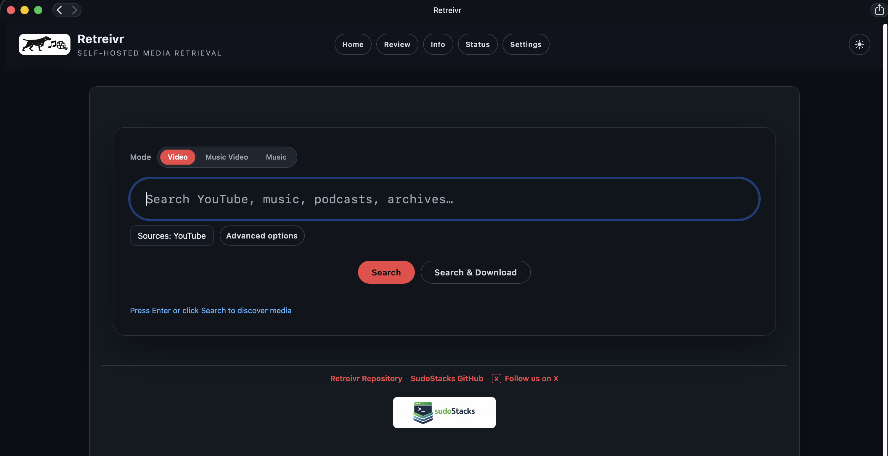
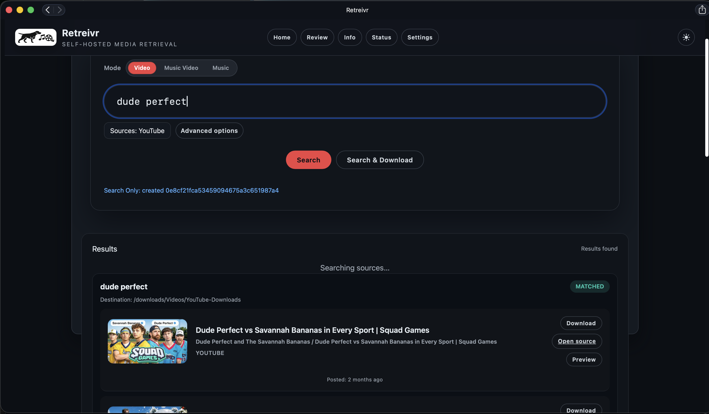
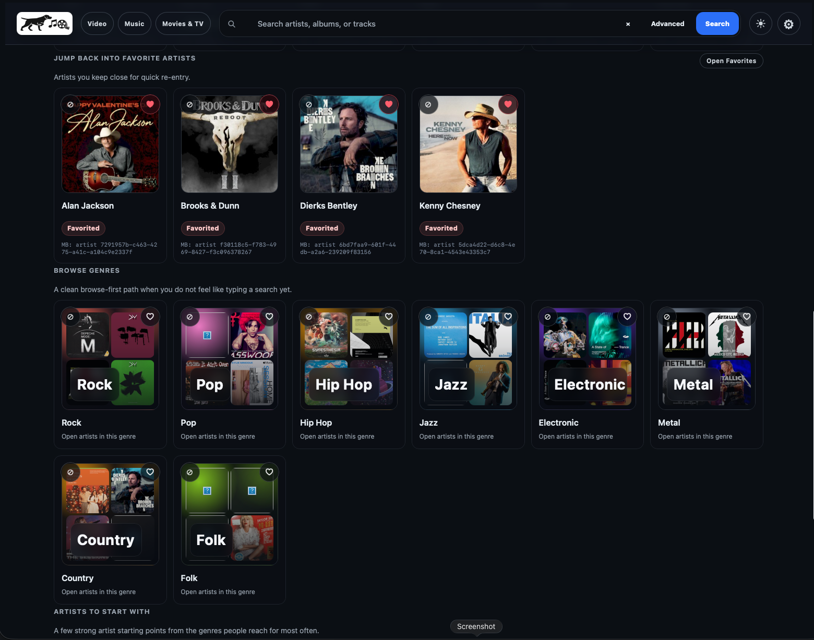
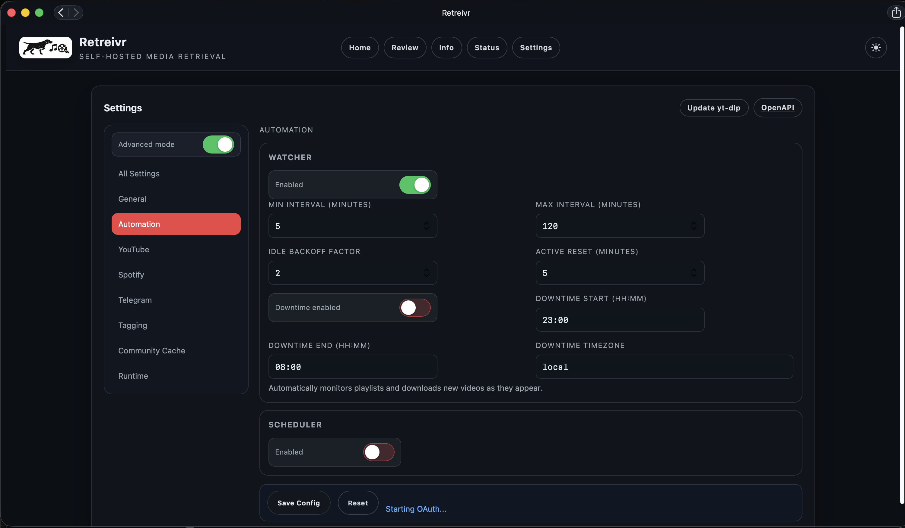
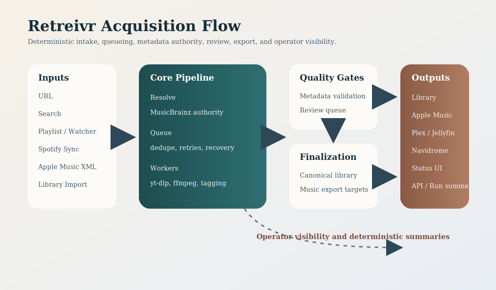

<p align="center">
  
</p>

<h1 align="center">Retreivr</h1>

<p align="center">
  Self-hosted media acquisition for deterministic local libraries.
</p>

<p align="center">
  URLs, playlists, search, Spotify sync, and library imports into a clean, predictable media archive.
</p>

<p align="center">
  Follow us on X: <a href="https://x.com/sudoStacks">https://x.com/sudoStacks</a>
</p>

---

## Interface Overview


## What Is Retreivr?
Retreivr is a self-hosted acquisition engine for building and maintaining a clean local media archive.

It takes your intent, resolves the target, downloads the media, normalizes metadata and naming, and writes predictable files to disk.

Retreivr is not a streaming server. It is the acquisition layer.

## Why Retreivr
- Deterministic acquisition instead of one-off, chaotic downloads
- MusicBrainz-first metadata authority for music workflows
- Clean filesystem output with canonical naming and finalization rules
- Unified queue, worker, watcher, scheduler, and review flows
- Web UI and API for operations, recovery, and automation
- Built for intentional local ownership, not algorithmic consumption

## 0.9.18 Highlights
- Community cache publish now resets stale rejected publish branches back to clean `main` before republishing
- The public dataset contract stays strict around canonical `youtube` source naming without replaying old invalid branch state
- Tagged music exports still inherit finalized canonical metadata deterministically before copy/transcode targets are written
- Local cache sync settings and operator workflow are now documented clearly for `0.9.18` deployments

## Product Tour

### Search And Queue Flow


### Music Mode Resolution


### Operations Status


## What It Does
- Acquire from direct URLs, playlists, search, Spotify sync, and library-import files
- Resolve media into canonical download and metadata workflows
- Finalize files into a clean, predictable local library
- Keep ingestion repeatable through queueing, retries, and review paths
- Expose live status, logs, metrics, and API endpoints for operators

## Core Use Cases

### Build a clean music library
Search by artist, album, or track and let Retreivr resolve downloads into structured local music files with metadata-first workflows.

### Import an existing library
Bring in Apple Music XML or similar exports and resolve them into queued acquisition jobs with import progress, rejection reasons, and recovery controls.

### Automate playlist and channel intake
Use watcher and scheduler flows to poll sources, detect new content, and ingest it into the same queue and finalization system.

### Use Spotify as an acquisition source
Sync intent from Spotify without turning Retreivr into a playback server.

### Operate it like infrastructure
Monitor queue health, review blocked work, recover stale jobs, and track subsystem state from the UI or API.

## Workflow Examples Placeholder
If you want a more visual middle section, add a row of 3 to 5 images or thumbnails here.

Recommended concepts:
- A YouTube playlist watcher view with newly detected items
- A Music Mode album search with strong matches
- A library import run with batch counters and rejection summaries
- A review queue screenshot showing operator approval workflow

Suggested assets:
- `docs/images/readme/watcher-example.png`
- `docs/images/readme/album-search-example.png`
- `docs/images/readme/library-import-example.png`
- `docs/images/readme/review-queue-example.png`

## How It Works
Retreivr follows a simple acquisition model:

1. Input arrives from URL, search, playlist, Spotify sync, or library import.
2. Resolver logic identifies the best target and metadata authority.
3. Jobs enter the queue and are claimed by workers.
4. Media is downloaded, post-processed, tagged, and finalized.
5. The UI and API expose status, logs, review states, and recovery actions.

## Architecture Diagram


## Quick Start

### Docker Compose
1. Prepare files:

```bash
cp docker/docker-compose.yml.example docker/docker-compose.yml
cp .env.example .env
```

2. Start Retreivr:

```bash
docker compose -f docker/docker-compose.yml up -d
```

3. Open the UI:

```text
http://localhost:8090
```

Default mapping is `8090:8000` (`host:container`).

### Initial Setup
- Open `Config`
- Add playlist, search, or music settings
- Set destination folders under `/downloads`
- Optionally configure Spotify OAuth and Telegram

## Release Outputs
- GitHub Container Registry image: `ghcr.io/sudostacks/retreivr:<tag>`
- Docker Hub image: `sudostacks/retreivr:<tag>`
- GitHub Release asset: `retreivr-docker-starter-<tag>.zip`

The Docker starter bundle contains:
- `docker-compose.yml`
- `.env.example`
- `config/config.json.example`
- `README-runtime.md`

## Ecosystem Repos
Retreivr is now part of a broader resolution-network ecosystem. If you want to participate beyond running a single node, these side repositories matter:

- Community cache dataset: `https://github.com/sudoStacks/retreivr-community-cache`
  - canonical public transport-resolution dataset
  - trusted publisher policy, validation rules, and contribution flow
- Jellyfin plugin: `https://github.com/sudoStacks/retreivr-jellyfin-plugin`
  - early Jellyfin-side integration for search, availability, and Retreivr-backed acquisition
- Plex plugin: `https://github.com/sudoStacks/retreivr-plex-plugin`
  - experimental legacy Plex integration path

If you want to contribute verified mappings back to the shared network, start with the community cache repository and its trusted publisher workflow.

## Canonical Docker Mounts
Use these container paths for predictable behavior:
- `/downloads` media output
- `/data` runtime DB and temp
- `/config` config JSON
- `/logs` logs
- `/tokens` auth and cookies

## Local Run
Requirements:
- Python `3.11.x`
- `ffmpeg` on PATH

Run:
```bash
python3.11 scripts/archiver.py --config data/config/config.json
```

Run API/UI locally:
```bash
python3.11 -m uvicorn api.main:app --host 127.0.0.1 --port 8000
```

Then open:
```text
http://localhost:8000
```

## Operations and Reliability
- Unified queue for import, watcher, search, and direct acquisition flows
- Live status for active jobs, queue health, watcher state, and import progress
- Recovery controls for stale or blocked work
- Review path for low-confidence music matches
- Metrics and API endpoints for operational visibility

## Useful Endpoints
- `GET /api/status`
- `GET /api/metrics`
- `POST /api/run`
- `GET /api/download_jobs`
- `POST /api/import/playlist`
- `GET /docs`

## Cache Configuration
Retreivr currently supports one cache concept in the acquisition pipeline:

- `community_cache_lookup_enabled`: Enables reading shared community transport hints. Defaults to `true`.
- `community_cache_publish_enabled`: Enables local proposal emission for contributing verified matches. Defaults to `false`.

Related controls:
- `community_cache_publish_mode`: `off | dry_run | write_outbox`
- `community_cache_publish_min_score`
- `community_cache_publish_outbox_dir`
- `community_cache_publish_repo`
- `community_cache_publish_target_branch`
- `community_cache_publish_branch`
- `community_cache_publish_open_pr`
- `community_cache_publish_poll_minutes`
- `community_cache_publish_token_env`
- `community_cache_publish_batch_size`

### Local Cache Sync
The `resolution_api` block controls optional node-to-node dataset sync for the Resolution API layer.

- `resolution_api.upstream_base_url`: Base URL of another Retreivr Resolution API node to sync from.
- `resolution_api.sync_enabled`: Enables scheduled pulls from that upstream node.
- `resolution_api.sync_poll_minutes`: How often to check for updates.
- `resolution_api.sync_batch_size`: How many records to request per sync batch.
- `resolution_api.local_node_id`: Stable identifier for this node in sync and verification flows.

When to use it:
- Leave it off for a single-node install that is already doing its own local acquisition and community-cache publishing.
- Enable it when you want this Retreivr instance to mirror resolution data from another Resolution API node for faster local lookups.

What the UI buttons do:
- `Run Cache Sync Now`: immediately pulls a sync batch from the configured upstream API.
- `Refresh Sync Status`: refreshes the last-sync state shown in Settings.

Minimum working setup for sync:
- set `resolution_api.upstream_base_url`
- enable `resolution_api.sync_enabled`
- choose a `resolution_api.local_node_id`

If `upstream_base_url` is blank, local cache sync should remain disabled.

## Docs
- Docker runtime notes: [docker/README.md](docker/README.md)
- Portainer deployment: [docs/portainer.md](docs/portainer.md)
- Container/data path guidance: [docs/paths.md](docs/paths.md)
- Runtime starter bundle notes: [README-runtime.md](README-runtime.md)

## Upgrade Notes
If you are upgrading to `0.9.18`, pull the latest image and restart:

```bash
docker compose -f docker/docker-compose.yml pull
docker compose -f docker/docker-compose.yml up -d
```

Your mounted `/data`, `/downloads`, `/config`, and `/tokens` persist.

## Scope Boundaries
Retreivr does:
- Acquire media reliably
- Normalize metadata and output structure
- Keep playlist and sync ingestion deterministic

Retreivr does not:
- Stream media
- Replace Plex or Jellyfin players
- Bypass DRM or protected content

## README Asset Checklist
Use this section as a build list for the final polished README assets.

- Hero dashboard screenshot
- Home or search workflow screenshot
- Music Mode / album-resolution screenshot
- Operations Status screenshot
- Optional watcher or playlist-ingest screenshot
- Optional review queue screenshot
- Simple architecture diagram

## License
Retreivr is licensed under the GNU Affero General Public License v3.0 (AGPLv3).
See the [LICENSE](LICENSE) file for full details.
