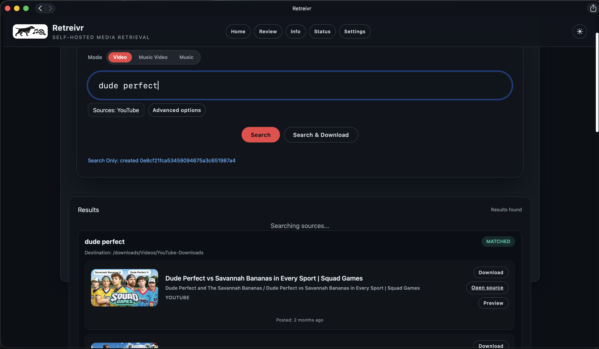
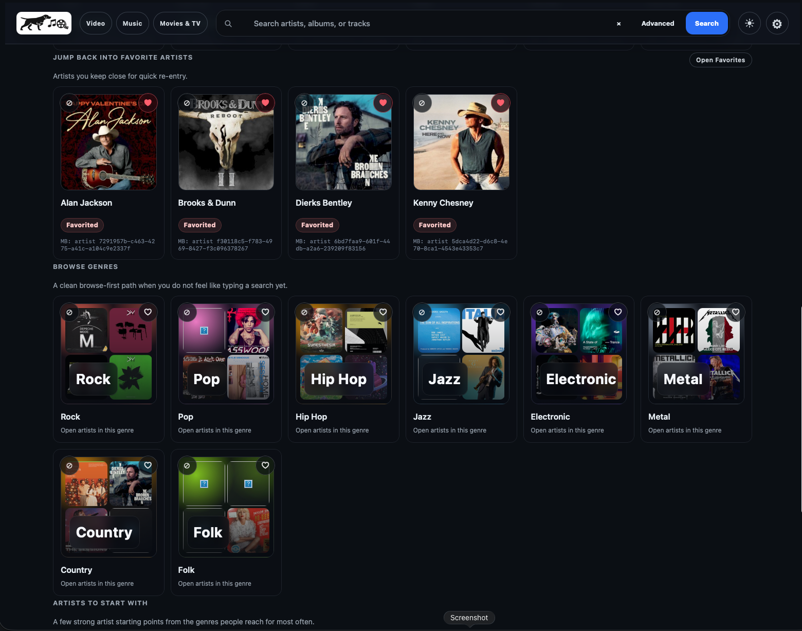
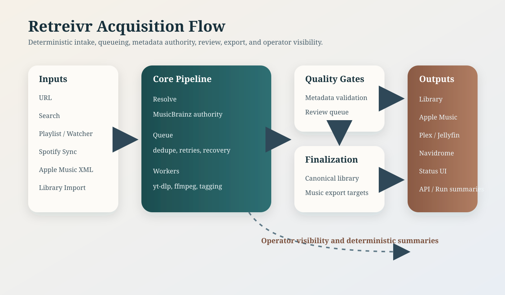

<p align="center">
  
</p>

<h1 align="center">Retreivr</h1>

<p align="center">
  Self-hosted media acquisition for deterministic local libraries.
</p>

<p align="center">
  Resolve metadata and media intent into deterministic source matches, playback, and clean local libraries.
</p>

<p align="center">
  Follow us on X: <a href="https://x.com/sudoStacks">https://x.com/sudoStacks</a>
</p>

---

## What Is Retreivr?
Retreivr is a self-hosted media-resolution and acquisition engine for building and maintaining clean local libraries.

It takes your intent, binds it to authoritative metadata, resolves a source, and can play, acquire, normalize, and organize the result. Qualified MusicBrainz-to-source matches can be retained locally and contributed to the public community cache so every participating Retreivr node becomes faster and more deterministic.

Retreivr is not intended to replace a full media server. It is the resolution and acquisition layer, with integrated music playback for discovery, radio, and pre-download listening.

## Why Retreivr
- Deterministic acquisition instead of one-off, chaotic downloads
- MusicBrainz-first metadata authority for music workflows
- Clean filesystem output with canonical naming and finalization rules
- Unified queue, worker, watcher, scheduler, and review flows
- Web UI and API for operations, recovery, and automation
- Built for intentional local ownership, not algorithmic consumption

## 1.1.8 Highlights
- YouTube video downloads retry with the Android player client when the default player path reports unavailable or format-only results
- Watcher failure-only Telegram messages are deduped by YouTube video ID while later success notifications remain allowed
- Completed downloads normalize final file permissions so host shares can read files written by a root-running container
- YouTube `This video is not available` errors are classified as source-unavailable instead of generic download failures

## 1.1.0 Highlights
- Persistent Music playback across navigation, with minimized controls, full-player video docking, authoritative queues, artist shuffle, and diverse genre radio
- MusicBrainz-to-YouTube resolution lookahead that prepares upcoming songs and retains qualified source matches before playback
- End-to-end community-cache contributions from runtime resolution, radio lookahead, completed downloads, accepted Review items, and library backfill
- Books Mode with free-first search, Open Library/Internet Archive/Project Gutenberg discovery, rich detail cards, and one-click acquisition for eligible public files
- Refined Radio and Favorites shelves, stronger artwork fallbacks, and clearer loading/progress feedback throughout Music Mode

## 1.0.0 Highlights
- Brand-new Movies & TV browsing with setup-aware ARR integration for managed and existing Radarr/Sonarr/Prowlarr/Bazarr/qBittorrent/Jellyfin stacks
- Guided Setup now handles Retreivr-first onboarding, stack paths, preflight checks, service connections, and generated Docker Compose profile commands
- Music now includes a MusicBrainz-backed browse experience, favorites, local player, queues, radio/station flows, playlists, and metadata repair workflows
- Retreivr's original acquisition core remains intact for direct URLs, video downloads, playlist monitoring, Spotify sync, YouTube, Rumble, Archive.org, and library imports
- The compose/env/docs story is aligned around one canonical Retreivr-first stack with profile-based expansion instead of shipping ARR by default

## Product Tour

### Video Search & Download


### Music Browse & Download


### Music Player & Radio
Browse by artist or genre, start a shuffled mix, reorder the visible queue, and continue listening while navigating elsewhere in Retreivr. Remote tracks use a persistent YouTube iframe adapter while MusicBrainz remains the canonical recording identity.

### Books
Enable Books in Settings to search free-first public sources, inspect rich title metadata, and acquire eligible PDF or ebook files. See [Books Mode](docs/books_mode.md) for source and availability details.

### Movies & TV


### Guided Setup


## What It Does
- Acquire from direct URLs, playlists, search, Spotify sync, and library-import files
- Search and acquire free/public books through the optional Books Mode
- Play unresolved music before download through a persistent YouTube-backed player and radio queue
- Resolve media into canonical download and metadata workflows
- Finalize files into a clean, predictable local library
- Keep ingestion repeatable through queueing, retries, and review paths
- Expose live status, logs, metrics, and API endpoints for operators

## Core Use Cases

### Build a clean music library
Search by artist, album, or track and let Retreivr resolve downloads into structured local music files with metadata-first workflows.

### Import an existing library
Bring in Apple Music XML or similar exports and resolve them into queued acquisition jobs with import progress, rejection reasons, and recovery controls.

### Automate playlist and channel intake
Use watcher and scheduler flows to poll sources, detect new content, and ingest it into the same queue and finalization system.

### Use Spotify as an acquisition source
Sync intent from Spotify without turning Retreivr into a playback server.

### Operate it like infrastructure
Monitor queue health, review blocked work, recover stale jobs, and track subsystem state from the UI or API.

## Workflow Examples Placeholder
If you want a more visual middle section, add a row of 3 to 5 images or thumbnails here.

Recommended concepts:
- A YouTube playlist watcher view with newly detected items
- A Music Mode album search with strong matches
- A library import run with batch counters and rejection summaries
- A review queue screenshot showing operator approval workflow

Suggested assets:
- `docs/images/readme/watcher-example.png`
- `docs/images/readme/album-search-example.png`
- `docs/images/readme/library-import-example.png`
- `docs/images/readme/review-queue-example.png`

## How It Works
Retreivr follows a simple acquisition model:

1. Input arrives from URL, search, playlist, Spotify sync, or library import.
2. Resolver logic identifies the best target and metadata authority.
3. Qualified MusicBrainz-to-source mappings are retained locally and can be proposed to the shared community cache.
4. Playback can begin immediately, or acquisition jobs enter the queue and are claimed by workers.
5. Downloaded media is post-processed, tagged, and finalized.
6. The UI and API expose status, logs, review states, and recovery actions.

## Architecture Diagram


## Quick Start

### Docker Compose
1. Prepare files:

```bash
cp docker/docker-compose.yml.example docker/docker-compose.yml
cp .env.example .env
```

2. Start Retreivr-only first:

```bash
docker compose -f docker/docker-compose.yml up -d
```

3. Open the UI:

```text
http://localhost:8090
```

Default mapping is `8090:8000` (`host:container`).

### Initial Setup
- Open `Setup` in the UI
- Retreivr-only mode is the default
- Enable ARR, downloader, VPN, or Jellyfin later from Retreivr when you actually want them
- When optional stack services are enabled, Retreivr generates the exact `docker compose --profile ... up -d` command to run
- Configure TMDb, YouTube, Telegram, storage paths, and connection health from guided setup cards or Settings

Recommended operator flow:
1. Start Retreivr only
2. Open `Setup`
3. Configure storage roots and required APIs
4. Enable optional infrastructure only if needed
5. Run the generated compose command
6. Return to `Connections` for verification and auto-config

For the full operator guide, see [docs/initial-setup.md](docs/initial-setup.md).

## Release Outputs
- GitHub Container Registry image: `ghcr.io/sudostacks/retreivr:<tag>`
- Docker Hub image: `sudostacks/retreivr:<tag>`
- GitHub Release asset: `retreivr-docker-starter-<tag>.zip`

The Docker starter bundle contains:
- `docker-compose.yml`
- `.env.example`
- `config/config.json.example`
- `README-runtime.md`

## Ecosystem Repos
Retreivr is now part of a broader resolution-network ecosystem. If you want to participate beyond running a single node, these side repositories matter:

- Community cache dataset: `https://github.com/sudoStacks/retreivr-community-cache`
  - canonical public transport-resolution dataset
  - trusted publisher policy, validation rules, and contribution flow
- Jellyfin plugin: `https://github.com/sudoStacks/retreivr-jellyfin-plugin`
  - early Jellyfin-side integration for search, availability, and Retreivr-backed acquisition
- Plex plugin: `https://github.com/sudoStacks/retreivr-plex-plugin`
  - experimental legacy Plex integration path

Retreivr can contribute qualified mappings automatically when community publishing is enabled. Runtime resolution, radio lookahead, completed downloads, accepted Review items, and library backfill all feed the same outbox and trusted PR publisher workflow.

## Canonical Docker Mounts
Use these container paths for predictable behavior:
- `/downloads` media output
- `/data` runtime DB and temp
- `/config` config JSON
- `/logs` logs
- `/tokens` auth and cookies

## Local Run
Requirements:
- Python `3.11.x`
- `ffmpeg` on PATH

Run:
```bash
python3.11 scripts/archiver.py --config data/config/config.json
```

Run API/UI locally:
```bash
python3.11 -m uvicorn api.main:app --host 127.0.0.1 --port 8000
```

Then open:
```text
http://localhost:8000
```

## Operations and Reliability
- Unified queue for import, watcher, search, and direct acquisition flows
- Live status for active jobs, queue health, watcher state, and import progress
- Recovery controls for stale or blocked work
- Review path for low-confidence music matches
- Metrics and API endpoints for operational visibility

## Useful Endpoints
- `GET /api/status`
- `GET /api/metrics`
- `POST /api/run`
- `GET /api/download_jobs`
- `POST /api/import/playlist`
- `GET /docs`

## Cache Configuration
Retreivr uses the community cache as a shared MusicBrainz-recording-to-source resolution layer:

- `community_cache_lookup_enabled`: Enables reading shared community transport hints. Defaults to `true`.
- `community_cache_publish_enabled`: Enables local proposal emission for contributing qualified matches. Defaults to `false`.

Related controls:
- `community_cache_publish_mode`: `off | dry_run | write_outbox`
- `community_cache_publish_min_score`
- `community_cache_publish_outbox_dir`
- `community_cache_publish_repo`
- `community_cache_publish_target_branch`
- `community_cache_publish_branch`
- `community_cache_publish_open_pr`
- `community_cache_publish_poll_minutes`
- `community_cache_publish_token_env`
- `community_cache_publish_batch_size`

When contribution is enabled, a mapping must contain a MusicBrainz recording ID, a supported source identity and URL, and a score meeting `community_cache_publish_min_score`. Pending duplicate recording/source pairs are collapsed before the publisher opens or updates its GitHub pull request. The current public dataset transport contract is YouTube-family specific; the local Resolution API remains the boundary for future provider-neutral expansion.

### Local Cache Sync
The `resolution_api` block controls optional node-to-node dataset sync for the Resolution API layer.

- `resolution_api.upstream_base_url`: Base URL of another Retreivr Resolution API node to sync from.
- `resolution_api.sync_enabled`: Enables scheduled pulls from that upstream node.
- `resolution_api.sync_poll_minutes`: How often to check for updates.
- `resolution_api.sync_batch_size`: How many records to request per sync batch.
- `resolution_api.local_node_id`: Stable identifier for this node in sync and verification flows.

When to use it:
- Leave it off for a single-node install that is already doing its own local acquisition and community-cache publishing.
- Enable it when you want this Retreivr instance to mirror resolution data from another Resolution API node for faster local lookups.

What the UI buttons do:
- `Run Cache Sync Now`: immediately pulls a sync batch from the configured upstream API.
- `Refresh Sync Status`: refreshes the last-sync state shown in Settings.

Minimum working setup for sync:
- set `resolution_api.upstream_base_url`
- enable `resolution_api.sync_enabled`
- choose a `resolution_api.local_node_id`

If `upstream_base_url` is blank, local cache sync should remain disabled.

## Docs
- Docker runtime notes: [docker/README.md](docker/README.md)
- Portainer deployment: [docs/portainer.md](docs/portainer.md)
- Container/data path guidance: [docs/paths.md](docs/paths.md)
- Initial setup guide: [docs/initial-setup.md](docs/initial-setup.md)
- Runtime starter bundle notes: [README-runtime.md](README-runtime.md)

## Upgrade Notes
If you are upgrading to `1.1.8`, pull the latest image and restart:

```bash
docker compose -f docker/docker-compose.yml pull
docker compose -f docker/docker-compose.yml up -d
```

Your mounted `/data`, `/downloads`, `/config`, and `/tokens` persist.

## Scope Boundaries
Retreivr does:
- Acquire media reliably
- Normalize metadata and output structure
- Keep playlist and sync ingestion deterministic

Retreivr does not:
- Stream media
- Replace Plex or Jellyfin players
- Bypass DRM or protected content

## README Asset Checklist
Use this section as a build list for the final polished README assets.

- Hero dashboard screenshot
- Home or search workflow screenshot
- Music Mode / album-resolution screenshot
- Operations Status screenshot
- Optional watcher or playlist-ingest screenshot
- Optional review queue screenshot
- Simple architecture diagram

## License
Retreivr is licensed under the GNU Affero General Public License v3.0 (AGPLv3).
See the [LICENSE](LICENSE) file for full details.
